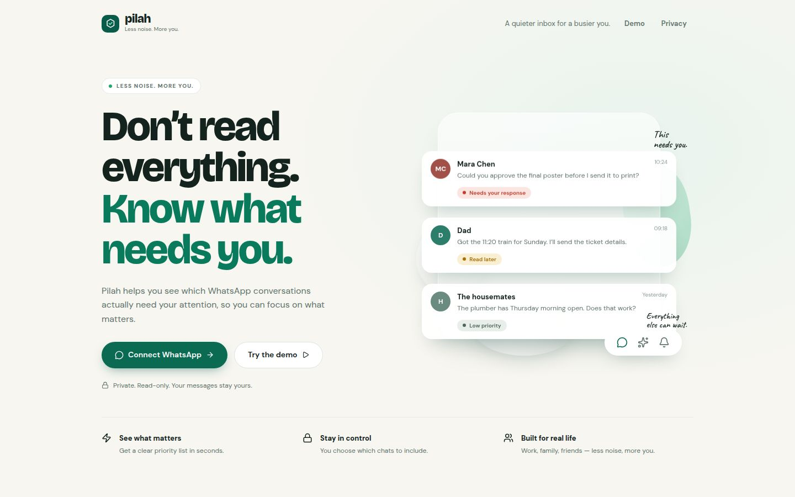
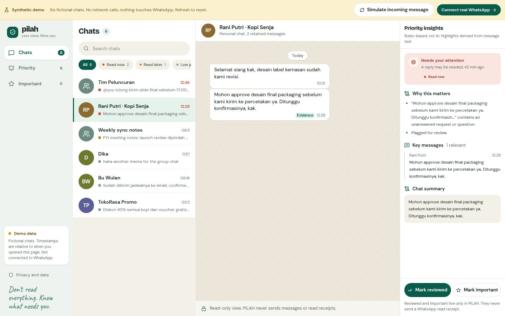

# PILAH

**Less noise. More you.**

### Don't read everything. Know what needs you.

PILAH helps you find the WhatsApp conversations that actually need your attention.
Connect your phone, choose the chats you care about, and see what to read now,
what can wait, and why—with the original messages right beside the explanation.

**[Visit PILAH](https://pilah-whats-app-inbox.replit.app) ·
[Try the synthetic demo](https://pilah-whats-app-inbox.replit.app/demo) ·
[Privacy](https://pilah-whats-app-inbox.replit.app/privacy)**

> A personal, single-owner hackathon prototype. Read-only, rules-based, and
> unofficial—not affiliated with WhatsApp or Meta. No AI service is used.

## Screenshots

### A quieter starting point



### Your chats, their context, and the reason they matter



All conversations shown above are fictional. These screenshots contain no
private WhatsApp messages, account credentials, or pairing QR codes.

## What PILAH does

- **QR-only sign-in:** scan with your phone; no separate password.
- **Choose your scope:** select individual chats, all chats, or the recent 10.
- **Prioritize your inbox:** Read now, Read later, and Low priority.
- **Explain the result:** view detected requests, deadlines, and exact message evidence.
- **Keep context:** read the retained conversation beside Priority Insights.
- **Stay in control:** mark chats important or reviewed inside PILAH only.
- **Try it safely:** a synthetic demo runs without connecting to WhatsApp.
- **Read, never send:** no messages, reactions, typing indicators, or read receipts.

## The simple flow

```text
Open PILAH → Scan WhatsApp QR → Choose chats → Read your priority inbox
                                                   ↓
                                   See the reason and source messages
```

Incoming selected-chat text is normalized, checked against deterministic rules,
and ranked. Questions, requests, mentions, and deadlines are signals—not a
guarantee of urgency. Partial history and unclear context are explicitly flagged.

## Built with

| Layer | Technology |
| --- | --- |
| Website | React, TypeScript, Vite |
| Styling and icons | Tailwind CSS, Lucide |
| Server | Node.js, Express |
| WhatsApp connection | Baileys, QRCode |
| Database | PostgreSQL, Drizzle ORM |
| API contracts | OpenAPI, Orval, Zod |
| Server data in the UI | TanStack Query, server-sent events |
| Shared priority logic | TypeScript rules engine |
| Workspace | pnpm |

## Project structure

```text
artifacts/pilah/          Website and inbox
artifacts/api-server/     API, browser sessions, encrypted storage, WhatsApp adapter
artifacts/mockup-sandbox/ Design previews, separate from the live product
lib/pilah-core/           Shared rules and message normalization
lib/db/                   Database schema and migrations
lib/api-spec/             OpenAPI source contract
lib/api-client-react/     Generated frontend API client
lib/api-zod/              Generated server validation
docs/screenshots/         Safe product screenshots
```

## Technical overview

A single-owner, read-only WhatsApp priority inbox. React/Vite/Tailwind frontend,
Express backend, PostgreSQL persistence, authenticated server-sent updates, and a
server-only Baileys adapter. This prototype uses **Rules-based** ranking; no
external AI provider is connected and no external model calls are made.

## Run

Use the existing Replit Run workflows: `artifacts/api-server: API Server` and
`artifacts/pilah: web`. Install workspace packages with `pnpm install`.

For manual local development, stop those workflows first, then use two shells:

```sh
PORT=8080 pnpm --filter @workspace/api-server run dev
PORT=22229 BASE_PATH=/ pnpm --filter @workspace/pilah run dev
```

Replit routes the frontend at `/` and backend at `/api`; do not add a second
framework or hardcode localhost in browser requests. Node 24 is used here;
Baileys requires Node 20 or newer and is pinned to `7.0.0-rc14`.

## QR sign-in and database

Owner sign-in is **WhatsApp's QR scan, with no password**. Open Connect real
WhatsApp, accept the linked-device notice, and scan from your phone. The browser
that successfully pairs becomes the owner and keeps a secure, HTTP-only session
for 30 days. An unfinished QR attempt grants no access to messages and expires
after 15 minutes. Another phone cannot claim an existing owner's retained data.
The old `PILAH_OWNER_PASSWORD` setting is no longer required; leave it alone.
Encryption is automatic: HKDF-SHA256 derives separate encryption and Signal
record-indexing keys from the existing server `SESSION_SECRET`. This secret must
remain private, stable and at least 32 characters; owners do not generate an
additional encryption key. Never store the master/derived keys in the database.
Valid existing `PILAH_DATA_ENCRYPTION_KEY` installations remain compatible with
their original versioned ciphertext and indexes. New setups do not need this
variable; an absent/short legacy placeholder uses managed encryption. Legacy
ciphertext cannot be decrypted without its original dedicated key. Do not
change encryption source or rotate its underlying secret without a migration.
`DATABASE_URL` is supplied by the existing PostgreSQL setup.
`.env.example` contains placeholders only; the app does not automatically load it.
Missing server security configuration locks live pairing. The already-configured
server key handles encryption automatically. The demo opens without any sign-in.

Database schema: `lib/db/src/schema/pilah.ts`. Initial SQL migration and journal:
`lib/db/drizzle/`. On a **fresh** database run
`pnpm --filter @workspace/db migrate`. The current development database was
initialized with `pnpm --filter @workspace/db push`; do not replay an initial
CREATE TABLE migration onto an already initialized database. Use `push` for
development changes; review the platform's production schema changes when
publishing. Do not copy live authentication data between environments.

## Demo and linking

- `/demo` is six fictional bilingual chats in browser memory only. It makes no
  live API calls, opens no event stream and uses no storage or credentials.
- Click **Simulate incoming message**. An approval request due in 30 minutes is
  normalized and ranked through the same shared rules engine as live messages.
  Its conversation moves to **Read now**; **View context** reveals the exact
  message and evidence.
- `/live` uses QR-only sign-in. Accept the linked-device notice, then
  link using WhatsApp → Settings → Linked devices → Link a device.
- **A human must scan the real QR. Live pairing has not been verified.**
- All chats start unselected. Select individual chats/groups to retain and rank
  their supported recent text. Limited history is requested where available.
  Missing history does not block new selected-chat messages.
- **Select all chats** and **Select recent 10** add to your existing selection;
  they do not clear selections, messages, or review preferences.

This is an **unofficial integration, not affiliated with WhatsApp or Meta**.
Use a dedicated test account. Linking gives WhatsApp linked-device access, not
WhatsApp-level permission limited to selected chats. The server may receive
unselected messages transiently; their bodies are discarded before application
storage or analysis. This is not ban-proof and processing is not phone-only.

## Privacy and limits

- Credentials and **all Signal key categories**, chat names, retained text,
  sender names and derived summaries use authenticated AES-256-GCM encryption.
- Sessions use random tokens, hashed server-side storage, secure HTTP-only
  SameSite cookies, bounded login attempts and same-origin mutation checks.
  Live inbox APIs and SSE require phone-authorized owner authentication.
  QR state is visible only to its initiating browser, which cannot read messages
  until phone pairing succeeds.
- Context is at most **50 messages per selected chat, within 7 days**. A
  background cleanup and read/write checks remove expired content and summaries.
- No attachments are downloaded. Unsupported media metadata can remain with
  **Needs review**. Disappearing/view-once content is excluded.
- Only supported direct/group chat identifiers are processed; broadcasts,
  status and newsletters are excluded. Phone/LID aliases use Baileys mappings.
- Owner replies are preserved. Multiple requests are tracked separately;
  casual new text does not clear an outstanding request. Deadlines are anchored
  to source timestamps in Asia/Jakarta; ambiguous times remain null.
- Important/reviewed are PILAH preferences, never WhatsApp read receipts.
  There is no sending, replying, reacting, presence or typing UI.
- `/privacy` can disconnect or **Disconnect and delete my data**. Deletion stops
  reconnects, invalidates in-flight work and clears application-held auth,
  context, summaries, preferences and sessions. If remote logout cannot be
  confirmed, remove PILAH manually in your phone's Linked devices screen.
- Deletion cannot erase WhatsApp copies or platform backups outside the app.
- AI opt-in is unavailable until a provider is configured. Enabling it through
  the API returns an explicit error; rules remain functional.

## Verification commands

```sh
pnpm run typecheck
pnpm --filter @workspace/pilah-core test
pnpm --filter @workspace/api-server test
pnpm --filter @workspace/api-server build
PORT=22229 BASE_PATH=/ pnpm --filter @workspace/pilah build
```

Storage tests override security secrets with synthetic test values in the test
process and create/drop a **separate temporary PostgreSQL schema**, never app
tables. Tests cover normalization, deadlines, misleading urgency, replies,
evidence, encrypted credentials/Signal keys, selection, deduplication, retention,
edits/deletions and in-flight erasure. Network pairing, account-specific history,
real reconnection/device logout and production hosting remain unverified.

## Publishing

The API artifact is configured to build an ESM bundle and run a long-lived Node
process; the frontend artifact serves its built static files. Publish them
together with `/api` routing. For the live connector choose **Reserved VM**:
it needs a persistent process and outbound WebSocket, not static-only or
scale-to-zero hosting.

This project's configured pairing runtime is production: the published website,
not Preview. A fresh clone defaults to development unless
`PILAH_LIVE_RUNTIME` is explicitly supplied. To enable published pairing, disconnect
and stop development pairing, set `PILAH_LIVE_RUNTIME=production`, supply
production secrets/database schema, and restart or republish the backend.
A database advisory lock prevents two processes sharing a database from owning
the socket. Separate development/production databases cannot share that lock;
do not enable/pair the same account in both environments. Reconnect attempts
are bounded, but real account/network behavior still needs a human linking test.
See [Replit deployment types](https://docs.replit.com/features/publishing/deployment-types).

## Known limitations

- Baileys is an unofficial linked-device integration; availability can change.
- Real phone pairing, account-specific history, and reconnection require a human
  test. Screenshots and synthetic tests are not proof of live-account operation.
- Rules can miss implicit requests or misread ambiguous language.
- PILAH is designed for one owner, not a team inbox or public multi-user service.
- A linked device has broader access than PILAH's application-level chat selection.
- Hosting must support a persistent connection for reliable continuous syncing.